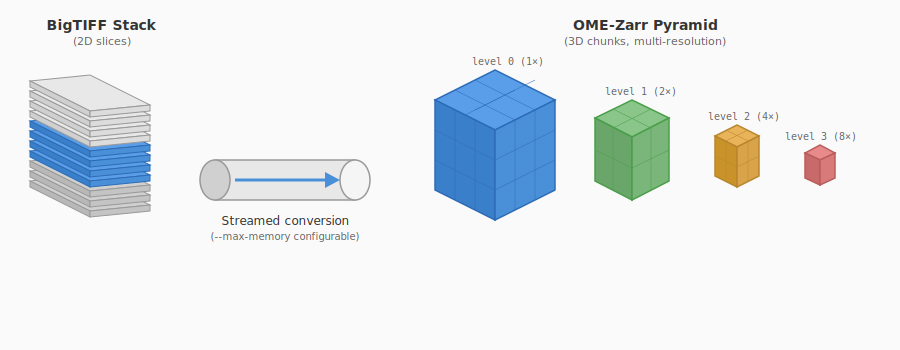
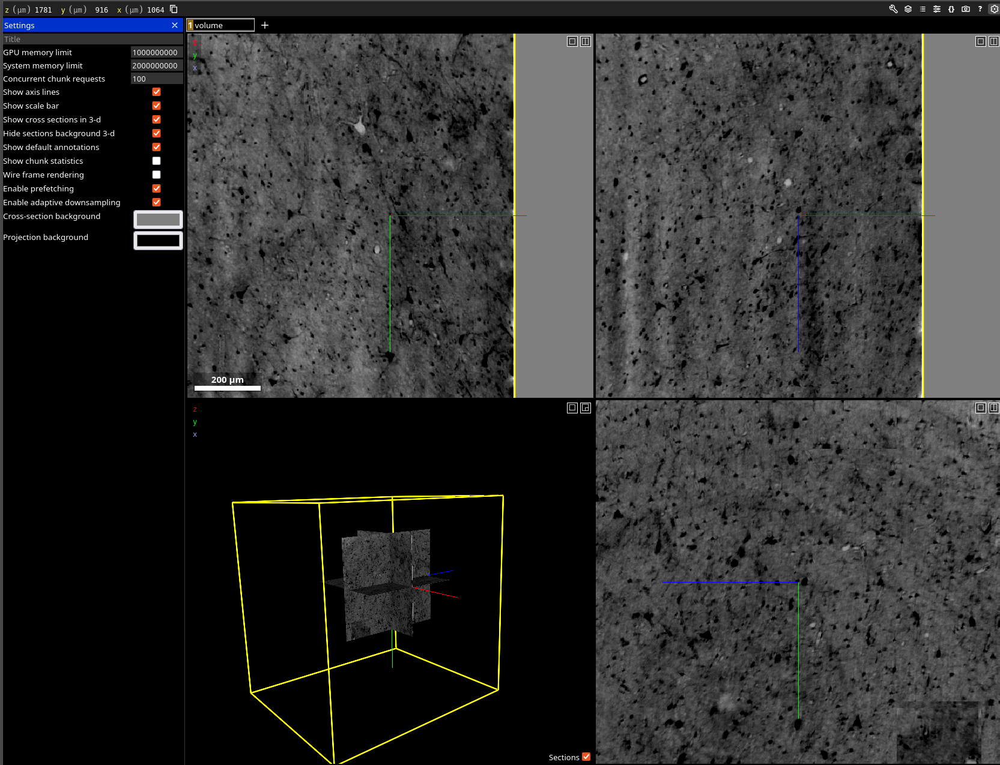

# microct_io_vis

Convert large micro-CT volumes (BigTIFF) to OME-Zarr with multi-resolution pyramids for visualization in Neuroglancer.

## Features

- **Streaming conversion**: Process 56GB+ volumes without loading into RAM
- **Multi-resolution pyramids**: Automatic 2x downsampling at each level
- **Memory-aware buffering**: Configurable memory budget for I/O optimization
- **Neuroglancer visualization**: Built-in viewer with HTTP pyramid serving

## Installation

```bash
pip install -r requirements.txt
```

## Usage

### Convert BigTIFF to OME-Zarr

```bash
# Basic conversion with isotropic chunks (best for visualization)
python examples/convert_tiff_to_zarr.py input.tif output.zarr -c 128 128 128

# Custom memory budget and pyramid levels
python examples/convert_tiff_to_zarr.py input.tif output.zarr -c 128 128 128 -n 4 --max-memory 8G

# Inspect TIFF without converting
python examples/convert_tiff_to_zarr.py input.tif --info

# Estimate memory usage before conversion
python examples/convert_tiff_to_zarr.py input.tif output.zarr -c 128 128 128 --estimate

# Convert to uint16 (50% smaller output, good for visualization)
python examples/convert_tiff_to_zarr.py input.tif output.zarr -c 128 128 128 --dtype uint16
```



### Visualize in Neuroglancer

```bash
python examples/visualize_zarr.py output.zarr
```



## Benchmarks

Tested on a 52.64 GB BigTIFF volume with 128x128x128 chunks and 8GB memory budget:

| Levels | Compression | Write Time | Read Throughput | Output Size | Ratio |
|:------:|:-----------:|:----------:|:---------------:|:-----------:|:-----:|
|   1    | blosc-lz4   |    57.5s   |    3.13 GB/s    |   35.03 GB  |  66%  |
|   1    | blosc-zstd  |    45.3s   |    3.13 GB/s    |   34.58 GB  |  66%  |
|   1    | none        |    54.5s   |    4.59 GB/s    |   53.13 GB  | 101%  |
|   3    | blosc-lz4   |   2m 18s   |    3.10 GB/s    |   40.07 GB  |  76%  |
|   3    | blosc-zstd  |   2m 05s   |    3.12 GB/s    |   39.55 GB  |  75%  |
|   3    | none        |   2m 17s   |    4.21 GB/s    |   61.13 GB  | 116%  |
|   5    | blosc-lz4   |   2m 05s   |    2.94 GB/s    |   40.16 GB  |  76%  |
|   5    | blosc-zstd  |   1m 51s   |    3.19 GB/s    |   39.63 GB  |  75%  |
|   5    | none        |   2m 05s   |    3.72 GB/s    |   61.41 GB  | 117%  |
|   7    | blosc-lz4   |   2m 18s   |    3.14 GB/s    |   40.16 GB  |  76%  |
|   7    | blosc-zstd  |   2m 06s   |    3.13 GB/s    |   39.63 GB  |  75%  |
|   7    | none        |   2m 21s   |    3.83 GB/s    |   61.41 GB  | 117%  |

**Recommendations:**
- Use `blosc-zstd` for best compression with good read speed
- Use `blosc-lz4` for fastest decompression
- 3-5 pyramid levels is the sweet spot (minimal size increase beyond that)

## Why OME-Zarr?

- Native Neuroglancer support
- Works with napari, FIJI, dask, xarray
- Cloud-ready (S3/GCS or local filesystem)
- Built-in multi-resolution pyramid spec (NGFF v0.4)

## Alternative Tools

Other OME-Zarr conversion tools worth evaluating:

- [bioformats2raw](https://github.com/glencoesoftware/bioformats2raw) - Java-based, supports all Bio-Formats file formats
- [BatchConvert](https://github.com/Euro-BioImaging/BatchConvert) - Nextflow wrapper for parallelized batch conversion

## Requirements

- Python 3.10+
- numpy, tifffile, zarr, scikit-image, tqdm, neuroglancer
